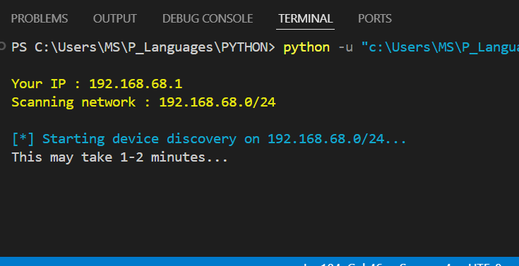
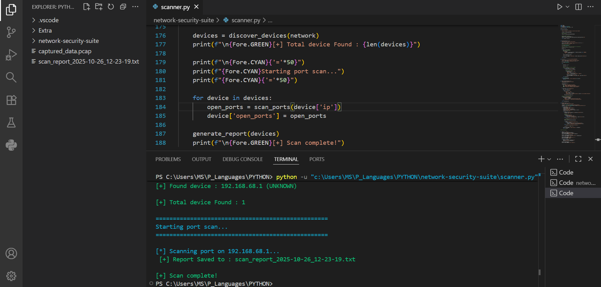
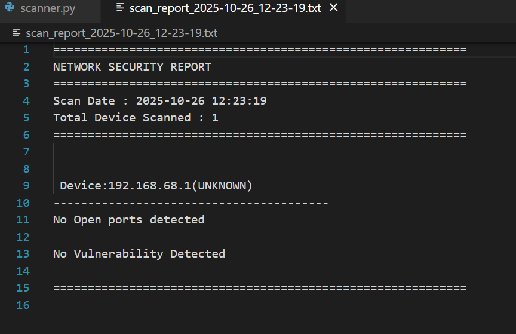
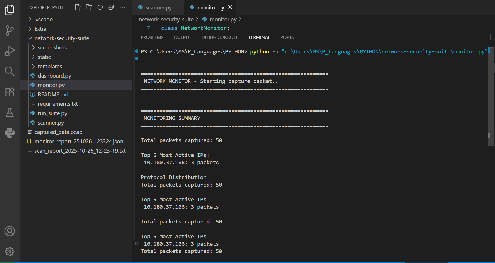
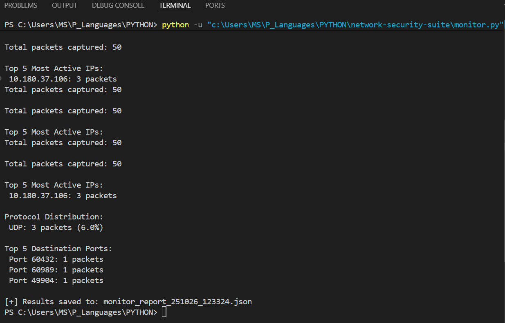
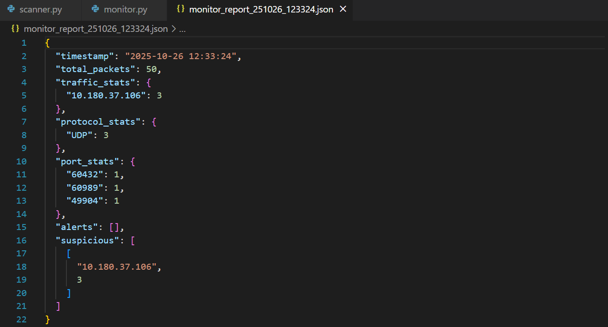
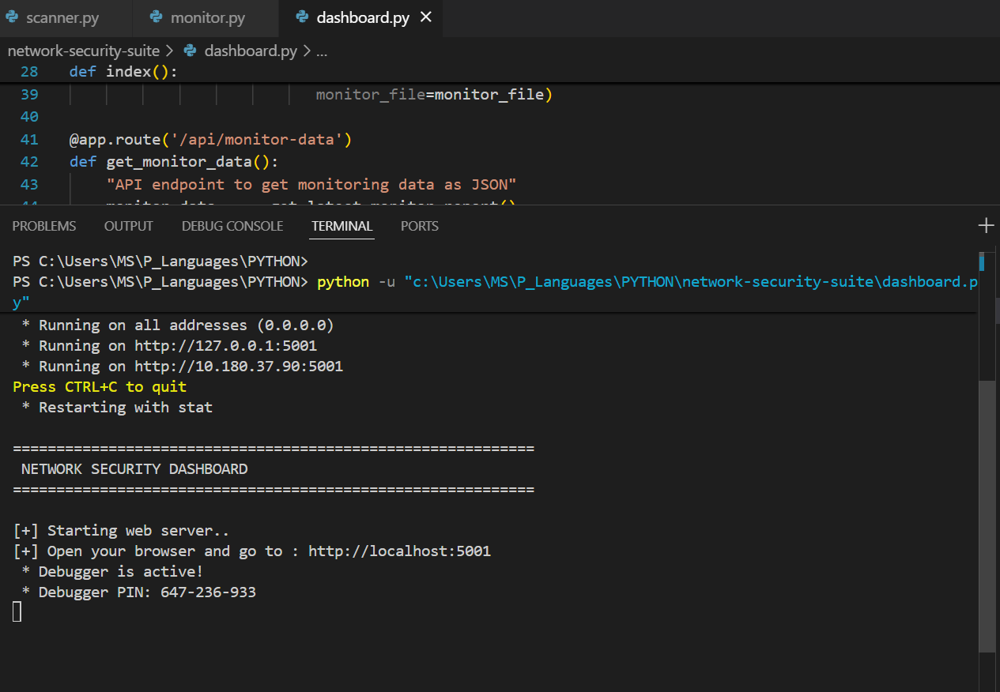
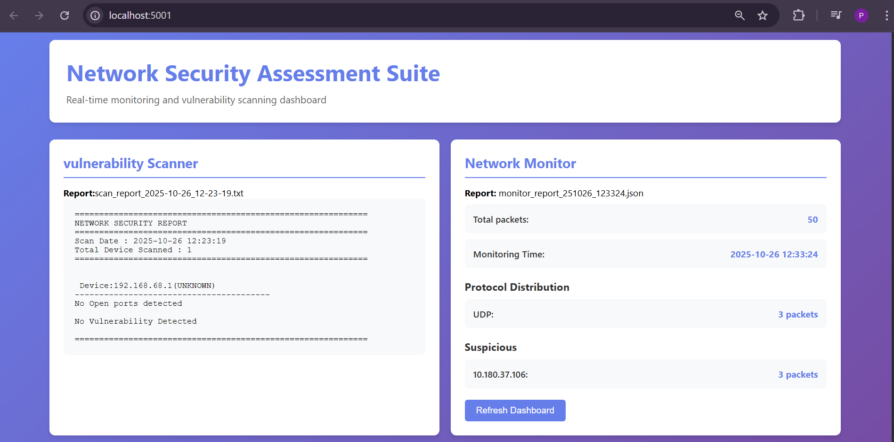

# Network Security Assessment Suite

A network security tool combining vulnerability scanning and real-time traffic monitoring.
**Note** : It is built for educatinal purpose. Don't try to use it for malicious purpose.

## Features

**Network Vulnerability Scanner**: Discovers devices and identifies open ports
**Real-time Traffic Monitor**: Detects suspicious activity and port scans
**Web Dashboard**: Place results in a web interface
**Alert System**: Get notified of security threats

## Technologies Used

- Python 3.13.5
- Scapy (Packet manipulation)
- Nmap (Port scanning)
- Flask (Web framework)
- Colorama (Terminal colors)

## Installation
```bash
# Clone repository
git clone https://github.com/prince-dholakiya/network-security-suite

# Install dependencies
pip install -r requirements.txt
```

## Usage
```bash
# Run full suite
python run_suite.py
python scanner.py      # Vulnerability scan
python monitor.py      # Network monitoring
python dashboard.py    # View results
```

## Screenshots

### Vulnerability Scanner




### Network Monitor




### Web Dashboard




## Learning Outcomes

Built while learning Python and cybersecurity concepts from Cisco certifications:
- Network fundamentals
- Port scanning techniques
- Packet analysis
- Security monitoring
- Web development

Note : This project is work when you connected with home/office network. It just scan local device when you connect with mobile hotspot or technology which isolates AP( or devices) .
